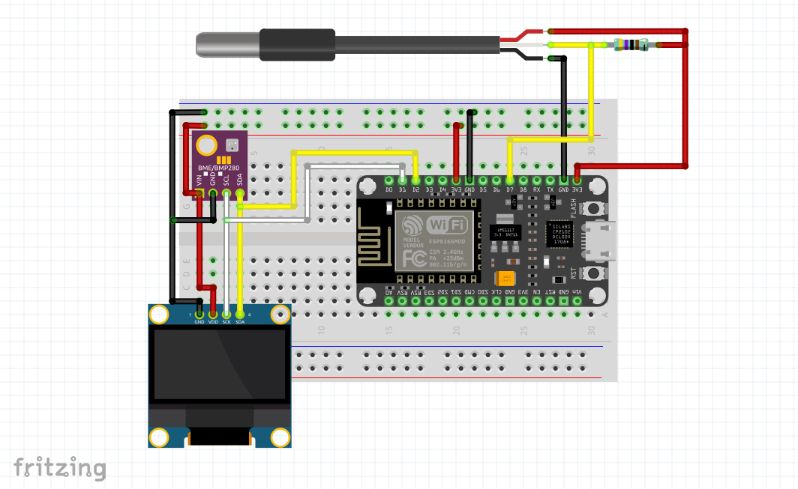
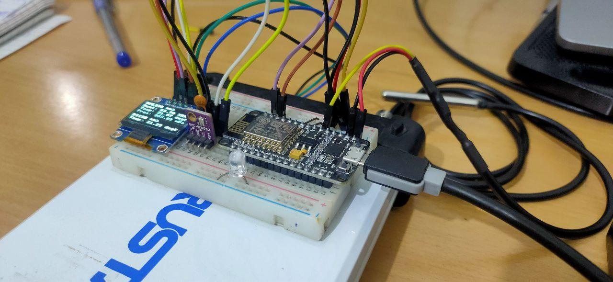
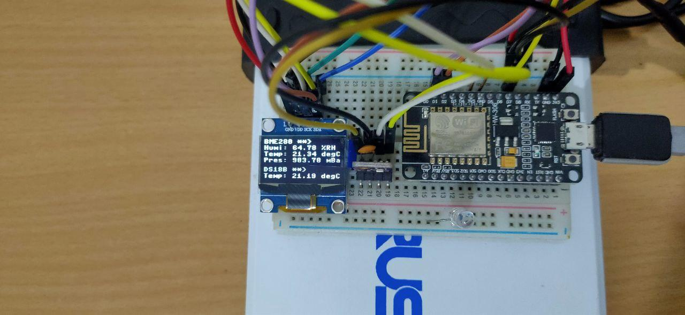

# micropython_datalogger_esp8266

A simple MicroPython script for data logging environmental sensors on ESP8266 board with OLED data display. This project follows SemVer guidelines for it's new releases/tags.

## Project Setup:
Wiring Diagram:

Project Setup:

OLED display showing data:

### Sensor Inputs:
- Bosch's BME280 in I2C mode.
- Maxim's DS18B29 in One Wire mode.

### Outputs:
- Serial terminal debugging logs.
- SSD1306 White OLED Display in I2C mode.
- Logging using Zapier workflow (zap) Integrating zapier webhook with Google sheets.

### Dev console config:
- OS: Linux x64 5.10.0-1055-oem
- VS Code Version: 1.63.2
- VS Code Extension: Pymakr v1.1.17

### Hardware Config:
- ESP8266 Node MCU V1.0 with Silicon Labs CP2102 UART to USB converter.
- MicroPython Firmware v1.18

### Expected New Features:
- SD Card Logging. (Using web agents/hooks from 3rd party is not very economic for an individual looking to log a large dataset.)
- Setting up Huginn a hackable and opensource alternative to IFTTT and Zapier. (For those who want their own service running.)
- Hotswappable sensors.
- Key-pad -> Adding ssid and password on the go.
- Key-pad -> Screen scrolling and menu navigation.

### References:
- More about editing Pymakr config file: https://github.com/pycom/pymakr-vsc/blob/HEAD/settings.md
