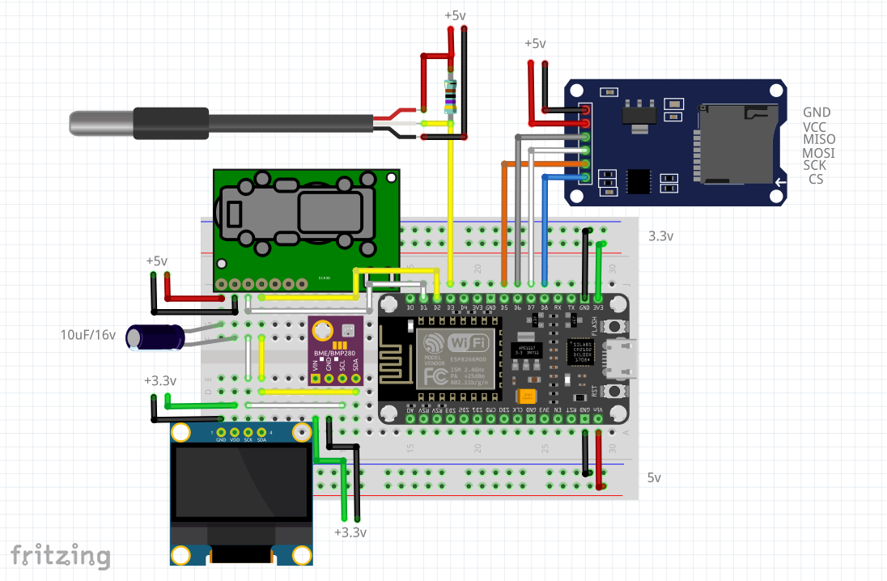
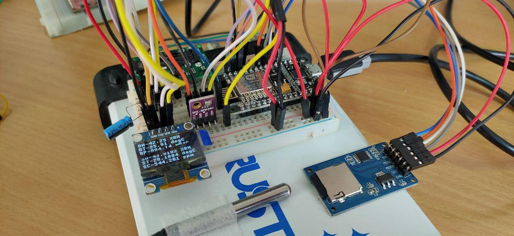
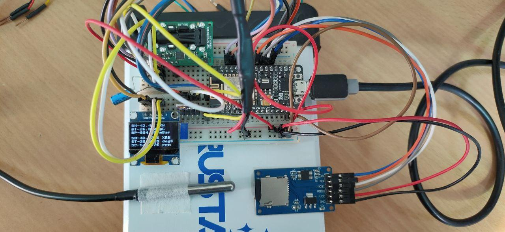

# micropython_datalogger_esp8266

A simple MicroPython script for data logging environmental sensors on ESP8266 board with OLED data display. Libs used in this project are freezed(.mpy), using [mpy-cross](https://github.com/micropython/micropython/tree/master/mpy-cross). Original source file is also included, checkout <kbd>driver-libs</kbd> directory. Libs under this directory can be changed and recompiled to suit your needs but it's seldom required unless you know what you are doing. Happy Hacking!!

** This project follows SemVer-v2.0.0 guidelines for it's new releases/tags.

## Project Setup:
Wiring Diagram:

Project Setup:

Top View:

### Sensor Inputs:
- Bosch's BME280 in I2C mode.
- Maxim's DS18B29 in One Wire mode.
- Sensirion's SCD30 in I2C mode.

### Outputs:
- Serial terminal debugging logs.
- SSD1306 White OLED Display in I2C mode.
- SD card logs using SD card module in SPI mode.
- Logging using Zapier workflow (zap) Integrating zapier webhook with Google sheets.

### Dev console config:
- OS: Linux x64 5.10.0-1055-oem
- VS Code Version: 1.63.2
- VS Code Extension: Pymakr v1.1.17

### Hardware Config:
- ESP8266 Node MCU V1.0 with Silicon Labs CP2102 UART to USB converter.
- MicroPython Firmware v1.18

### Expected New Features:
- Setting up Huginn a hackable and opensource alternative to IFTTT and Zapier. (For those who want their own service running.)
- Hotswappable sensors.
- Key-pad -> Adding ssid and password on the go.
- Key-pad -> Screen scrolling and menu navigation.

### References:
- More about editing Pymakr config file:[Pymaker config](https://github.com/pycom/pymakr-vsc/blob/HEAD/settings.md)
- Python cross compilation to bytecode: [mpy-cross](https://github.com/micropython/micropython/tree/master/mpy-cross)
